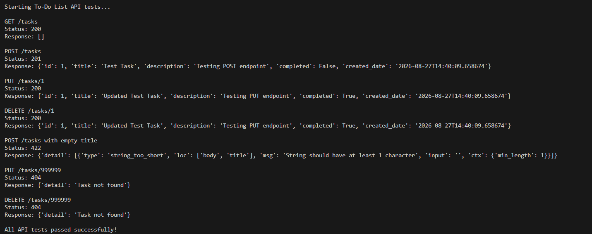

# To-Do List REST API

A RESTful To-Do List API built with **FastAPI** and **SQLite**.

The API provides CRUD operations for managing tasks and includes request validation, database-level constraints, error handling, CORS support, interactive Swagger documentation, and API testing.

---

## Repository approach
 
This assignment lives in its own repository (not a subfolder inside a
combined repo), as allowed by the assessment instructions.
 
## Features

- FastAPI REST API
- SQLite database
- CRUD operations for tasks
- Pydantic request and response models
- Empty-title validation
- Whitespace-only title validation
- Database-level validation constraints
- `completed` field restricted to `0` or `1`
- Proper HTTP status codes: `200`, `201`, `404`, `422`, and `503`
- `404` handling for non-existent tasks
- `503` handling for database availability errors
- CORS enabled for frontend integration
- Interactive Swagger documentation
- Python API test script
- Feature-based Git workflow

---

## Project Structure

```text
To-Do list/

├── tests/
│   └── test_api.py
├── screenshots/
│   └── api-tests.png
├── .gitignore
├── database.py
├── init_db.py
├── main.py
├── models.py
├── requirements.txt
├── README.md
└── tasks.db
```

---

## Database

SQLite is used for persistent task storage.

The `tasks` table contains:

| Column | Description |
|---|---|
| `id` | Auto-generated task ID |
| `title` | Task title |
| `description` | Optional task description |
| `completed` | Whether the task is complete |
| `created_date` | Task creation date/time |

`init_db.py` initializes the database, while `database.py` contains the CRUD database operations.

---

## Database Validation

Important validation rules are enforced at both the application and database levels.

### Completed Status

The `completed` column is restricted to `0` or `1`:

```sql
completed INTEGER NOT NULL DEFAULT 0 CHECK (completed IN (0, 1))
```

- `0` → Pending
- `1` → Completed

The column is also `NOT NULL` and defaults to `0`.

### Required Fields

Required fields such as `title` cannot contain `NULL` values.

Application-level validation also prevents empty or whitespace-only titles.

For example:

```text
""
"   "
"      "
```

are rejected as invalid titles.

---

## API Endpoints

### GET `/tasks`

Returns all tasks.

**Status:** `200 OK`

Example response:

```json
[
  {
    "id": 1,
    "title": "Complete assignment",
    "description": "Finish Assignment 4",
    "completed": false,
    "created_date": "2026-08-27T14:40:09.658674"
  }
]
```

### POST `/tasks`

Creates a new task.

**Status:** `201 Created`

Example request:

```json
{
  "title": "Complete assignment",
  "description": "Finish Assignment 4"
}
```

### PUT `/tasks/{id}`

Updates an existing task, including its completion status.

**Status:** `200 OK`

Example request:

```json
{
  "title": "Complete assignment",
  "description": "Assignment 4 completed",
  "completed": true
}
```

The original `created_date` is preserved when a task is updated.

### DELETE `/tasks/{id}`

Deletes an existing task.

**Status:** `200 OK`

---

## Validation and Error Handling

The API handles invalid input, missing resources, and database availability problems gracefully.

| Situation | Status |
|---|---:|
| Successful GET | `200` |
| Successful PUT | `200` |
| Successful DELETE | `200` |
| Successful POST | `201` |
| Task does not exist | `404` |
| Invalid request / empty title | `422` |
| Database unavailable | `503` |

### Empty Title Validation

A task title must contain at least one character.

The following request is invalid:

```json
{
  "title": "",
  "description": "Invalid task"
}
```

The API returns `422 Unprocessable Entity`.

### Whitespace-only Title Validation

Titles containing only whitespace are also rejected.

For example:

```json
{
  "title": "   ",
  "description": "Invalid task"
}
```

The API returns `422 Unprocessable Entity`.

This prevents tasks with empty or meaningless titles from being created.

### Non-existent Task Handling

Requests for a task ID that does not exist return `404 Not Found` instead of crashing the application.

For example:

```text
PUT /tasks/999999
```

returns:

```json
{
  "detail": "Task not found"
}
```

Similarly:

```text
DELETE /tasks/999999
```

returns `404 Not Found`.

### Database Error Handling

Database-related errors are handled gracefully.

If the application cannot access the SQLite database, the API returns:

```text
503 Service Unavailable
```

instead of exposing an internal database error or crashing the application.

---

## CORS

CORS is enabled so that a browser-based frontend can communicate with the API from a different origin.

This is required for **Assignment 5**, where the React frontend runs on a separate development server.

---

## Installation

### 1. Create a Virtual Environment

Windows PowerShell:

```powershell
python -m venv venv
```

Activate it:

```powershell
.\venv\Scripts\Activate.ps1
```

### 2. Install Dependencies

```powershell
python -m pip install -r requirements.txt
```

---

## Initialize the Database

Run:

```powershell
python init_db.py
```

This creates the SQLite database and `tasks` table if they do not already exist.

---

## Run the API

Start the FastAPI server:

```powershell
python -m uvicorn main:app --reload
```

The API will normally be available at:

```text
http://127.0.0.1:8000
```

---

## Interactive Documentation

FastAPI automatically generates interactive Swagger documentation.

Open:

```text
http://127.0.0.1:8000/docs
```

Swagger UI allows you to test all API endpoints directly from the browser.

You can use it to:

1. View all tasks
2. Create a task
3. Update a task
4. Mark a task as completed
5. Delete a task
6. Test empty-title validation
7. Test whitespace-only title validation
8. Test non-existent task handling

---

## Testing

The API test script is located at:

```text
tests/test_api.py
```

Start the API first:

```powershell
python -m uvicorn main:app --reload
```

Then, in another terminal, run:

```powershell
python tests/test_api.py
```

The test script exercises:

1. `GET /tasks`
2. `POST /tasks`
3. `PUT /tasks/{id}`
4. `DELETE /tasks/{id}`
5. Empty-title validation
6. Non-existent task handling

The script prints the HTTP status code and response for each test.

---

## Test Results

The following screenshot shows the API test script successfully exercising the required CRUD operations, validation, and error-handling cases.



The test output confirms:

- `GET /tasks` → `200`
- `POST /tasks` → `201`
- `PUT /tasks/{id}` → `200`
- `DELETE /tasks/{id}` → `200`
- Empty title validation → `422`
- Updating a non-existent task → `404`
- Deleting a non-existent task → `404`

**All API tests passed successfully.**

---

## Manual Swagger Testing

Recommended testing order:

1. Run the API.
2. Open `http://127.0.0.1:8000/docs`.
3. Test `GET /tasks`.
4. Test `POST /tasks` with a valid task.
5. Use the returned task ID for `PUT /tasks/{id}`.
6. Set `completed` to `true` to test task completion.
7. Test `DELETE /tasks/{id}`.
8. Verify the task has been deleted using `GET /tasks`.
9. Test an empty title.
10. Test a whitespace-only title.
11. Test a non-existent task ID.

---

## Git Workflow

The project was developed using a feature-based Git workflow.

Feature branches were used for individual API functionality:

```text
feature/get-tasks
feature/post-tasks
feature/put-tasks
feature/delete-tasks
```

Each feature was developed and committed separately before being merged into `main`.

This keeps the development history organized and makes individual changes easier to track.

---

## Release Tag

After verifying the final working version, create a release tag:

```powershell
git tag v1.0.0
```

Push the tag to GitHub:

```powershell
git push origin v1.0.0
```

---

## API Base URL

The default API URL is:

```text
http://127.0.0.1:8000
```

Interactive API documentation:

```text
http://127.0.0.1:8000/docs
```

---

## Technologies Used

- **Python**
- **FastAPI**
- **Pydantic**
- **SQLite**
- **Uvicorn**
- **REST API**
- **CORS**
- **Git & GitHub**

---
